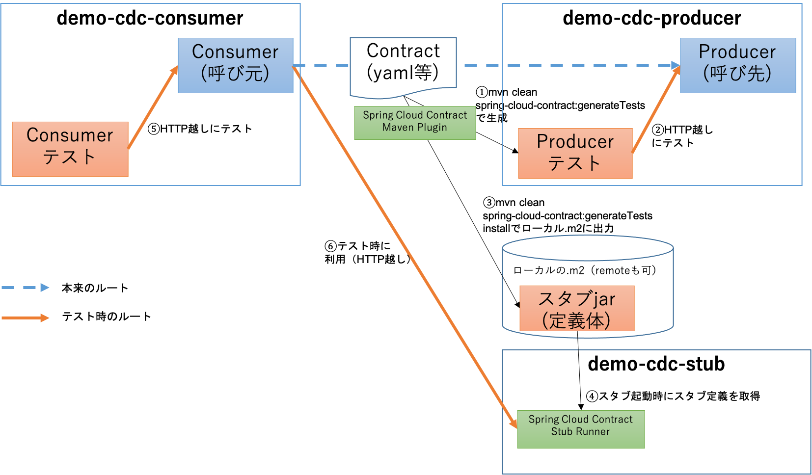

# demo-cdc
Spring Cloud Contractの利用サンプル。

通常利用と異なる点は、Consumerテスト時のスタブを**Consumerのテストプロセスとは別プロセスに切り出し**ていること。Spring Cloud Contractでは、Consumerテスト時はConsumerのJUnitテストクラス内でスタブサーバを展開することが多いが、JUnit以外のテストを行う場合や、**スタブをコンテナ等にデプロイして利用したい場合を想定**し、本サンプルを作成した。


# 構成


# 手順
## Producer側

### Contractからテストやスタブを生成、ローカルリポジトリにinstall

便宜上、ContractはProducer側に格納している。
`demo-cdc-producer`で以下のように、**Spring Cloud Contract Maven Plugin**を実行する。

```
$ mvn clean spring-cloud-contract:generateTests install
```

これにより以下が実行される。

- Producerに対するContract適合検証テストクラス生成
  - 本サンプルでは、[`EXPLICIT`モード](https://docs.spring.io/spring-cloud-contract/docs/current/reference/htmlsingle/#flows-provider-non-spring-producer)のテストクラスを生成するようにしている（実際にProducerのサーバを起動し、テストクラスから[HTTPリクエストを送受信](https://cloud.spring.io/spring-cloud-contract/reference/html/project-features.html#features-context-paths)してテスト）。［図の①］
- 上記のテスト実行［図の②］
- Contractに対応したスタブ資材のローカルリポジトリ（`.m2`）へのinstall［図の③］
  - スタブ資材の実体は、Contractファイルと、Contractから生成されたスタブサーバ（WireMock）向け定義ファイル

Contract適合検証テストがパスし、mvnがSUCCESSし、`.m2` にスタブのjar（`xxx-stubs.jar`）が出力されていることを確認。


## Consumer側
### スタブを起動
冒頭で示したよう本サンプルでは、スタブサーバは別PJのdemo-cdc-stubに切り出し、独立したプロセスとして動くようにしている。

`demo-cdc-stub`で以下でSpring Boot Appを起動すると、

```
$mvn spring-boot:run
```

以下のパスのように、8083ポートでスタブが起動する。[図の④]

http://localhost:8083/producer

これは、Spring Cloud Contract Stub Runnerの機能により、
先ほどローカルリポジトリ（`.m2`）にinstallしたスタブjar（`xxx-stubs.jar`）をDLし、そのスタブ定義をもとにスタブサーバを起動している。
スタブサーバ自体はWireMockであり、Spring Cloud Contract Stub Runnerに組み込まれて動作している。

本サンプルはローカルリポジトリから読み込むモードとしているが、取得元をRemote Repositoryに[変更](https://cloud.spring.io/spring-cloud-contract/reference/html/project-features.html#features-stub-runner-downloading-stub)することも可能であり、他人と分業している場合はそちらのほうが望ましい。

### スタブを用いてConsumerをテスト
`demo-cdc-consumer`の`DemoCdcApplicationTests`（Consumerの疎通テストケース）をJUnit実行。
Consumerの通信向き先について、`src/test/resources/applciation.properties`でスタブのURL、`http://localhost:8083/producer`に向けている。）

スタブが起動していることで、`DemoCdcApplicationTests`の疎通テストが成功することを確認。［図の⑤］

また、スタブサーバにもHTTPリクエストが届き、応答したことを示すログが出力されるので、合わせて確認する。［図の⑥］


# 参考
 https://iikanji.hatenablog.jp/entry/2020/08/04/235009
